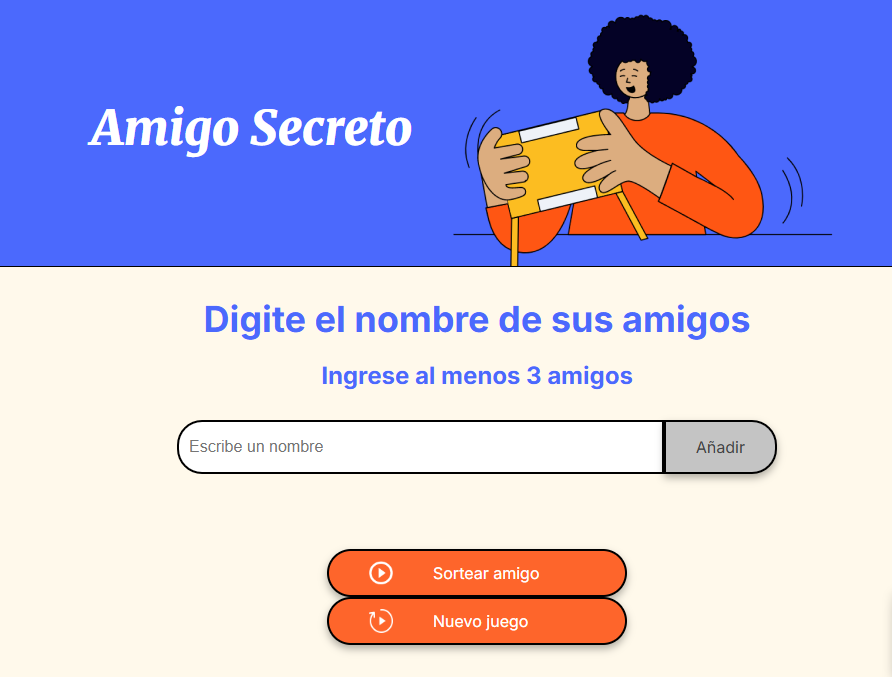

<h1>Challenge Amigo Secreto</h1>
<h4 margin-top="-100px">Oscar Alejandro Ortiz</h4>

## Bienvenido al repositorio 👋

Desarrollado con HTML, CSS y Javascript

* Funciones
* Controles de ingreso:
  - Que la lista tenga amigos
  - Que cumpla con la cantidad
  - Anula Boton Añadir una vez Sorteado
  
